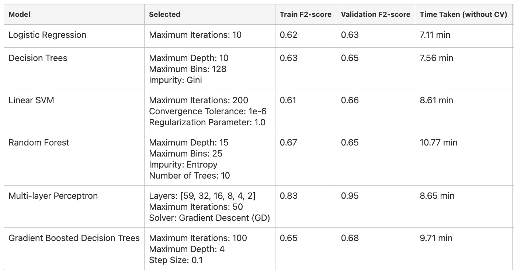

## Project Abstract
This project harnesses the power of Azure Databricks to build a distributed model for predicting flight delays, using over 40 million rows of data. It aims to help airlines reduce carbon emissions and improve air quality by leveraging vast datasets of historical flight and weather information.

## Motivation
Motivated by the urgent need for sustainable aviation practices, the project focuses on using big data analytics in Azure Databricks to predict flight delays. This approach is designed to minimize environmental impact and aid airlines in efficient operational management.

## Process Overview
The project is divided into three phases, executed in Azure Databricks to manage and analyze the big data effectively. Starting with setting objectives and preliminary data analysis, it progresses through extensive exploratory data analysis and model testing, concluding with feature enhancement and final model optimization.

## Project Timeline and Phases
Structured in distinct phases, the project efficiently utilizes Azure Databricks for handling big data. It starts with data exploration, advances through comprehensive analysis and modeling, and culminates in the finalization of predictive models.

## Custom Data Joining
A custom data joining process was developed in Azure Databricks to accurately merge vast datasets of flight and weather data. This improved the precision of our predictive models by ensuring accurate and efficient handling of over 40 million data points.

## Looking Forward
Future stages will extend the dataset to include years affected by the pandemic. This expansion will be managed in Azure Databricks, providing robust scalability for additional exploratory analysis and feature engineering on this large dataset.

## Experimental Results
The experimental pipeline in Azure Databricks led us to select the Gradient Boost model from several contenders. This process involved handling big data effectively to tune the model, ensuring it performed optimally on our extensive dataset.

## Challenges and Future Work
Handling the large scale of data in Azure Databricks presented unique challenges, particularly in terms of data scaling and temporal value. Future work will explore more sophisticated modeling techniques in Azure Databricks to refine our approach to big data analytics.

## Conclusion
Our project, leveraging Azure Databricks for big data analysis, successfully implemented a Gradient Boosted Decision Tree Classifier model to predict flight delays. This model, trained on over 40 million rows of data, promises significant benefits in reducing emissions and operational costs for airlines.

